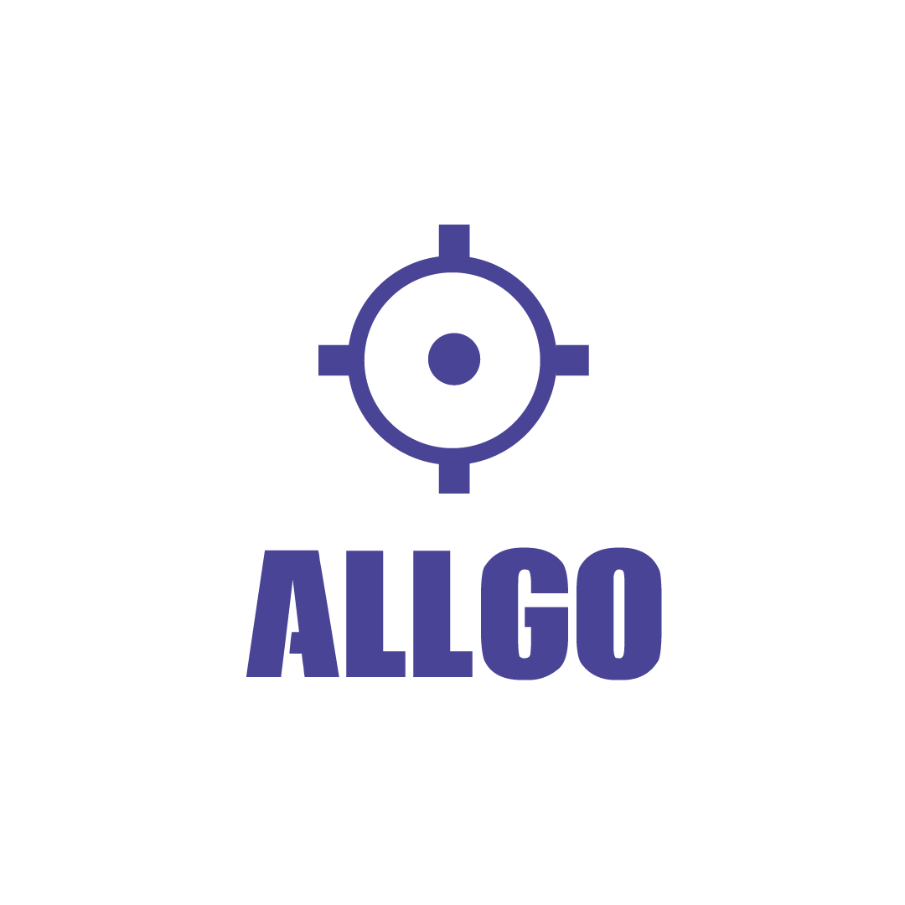

<h1 align="center">
 AllGo APP
</h1>

## ╾━╤デ╦︻ (▀̿ĺ̯▀̿ ̿)s

> Este repositório é um projeto para a comunidade de cs:go portuguesa. Não é nada mais nada menos que uma aplicação com todas as equipas, competições portuguesa (no ativo) e jogos do DIA com resultado ao vivo (todos os jogos dependem de ter uma pessoa por trás para atualizar o mesmo, por isso é natural se algum jogo não tenha o resultado ataulizado ronda por ronda).

---

## Redes Sociais

    

## 🍜 Licença

Esse projeto está sob licença. Veja o arquivo [LICENÇA](LICENSE.md) para mais detalhes. 